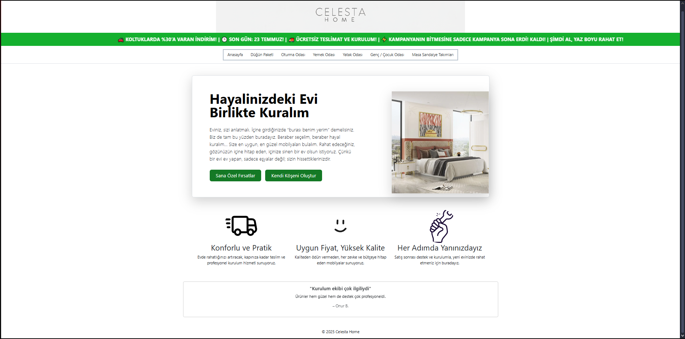
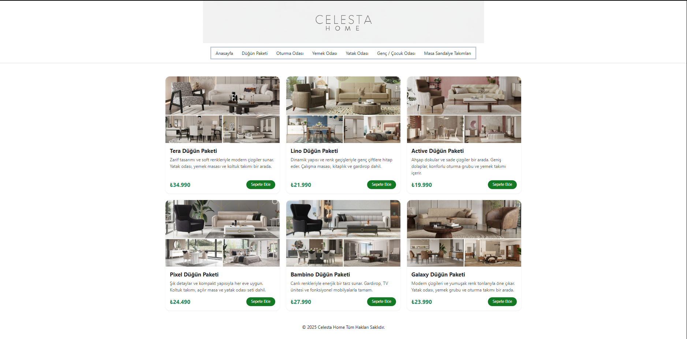
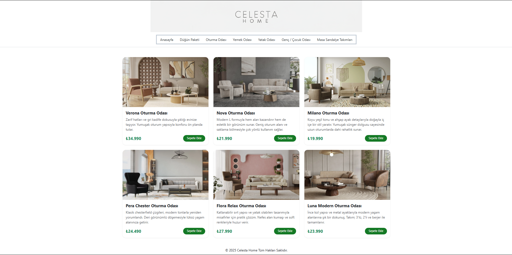
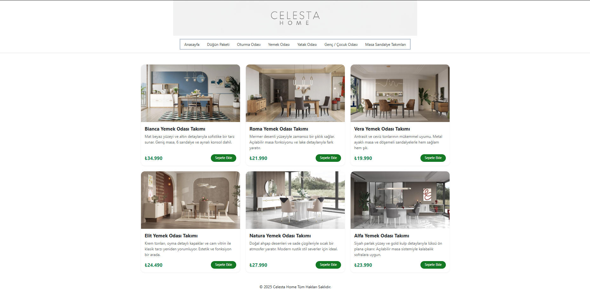
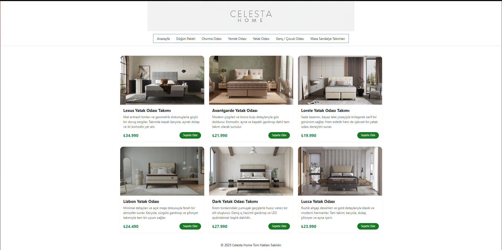
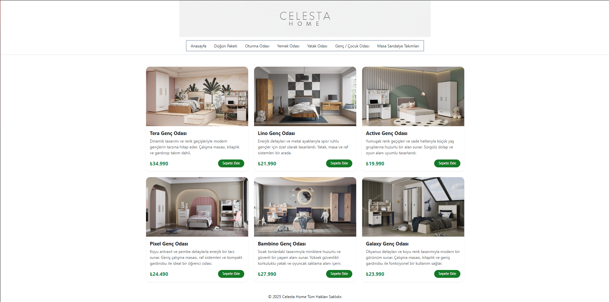

# Celesta Home - Eğitim ve Porföy amaçlı mobilya sitesi

🧾 Bu proje, basit bir mobilya tanıtım sitesidir. Sitede yalnızca görsel ve metin tabanlı tanıtım yer almakta olup, herhangi bir alışveriş veya kullanıcı işlemi sistemi bulunmamaktadır.
Proje tamamen eğitim ve portföy amaçlıdır.

⚠️ Görsel Kullanım Notu
Bu proje yalnızca kişisel portföy ve eğitim amaçlı hazırlanmıştır.
Projede kullanılan ürün görselleri Modalife.com’dan alınmıştır.
Tüm görseller ilgili markanın mülkiyetindedir. Ticari amaçla kullanılmamıştır. Sadece Eğitim Amaçlıdır.

---

## ✨ Özellikler

- Modern ve dinamik tasarım  
- Renk geçişleriyle gençlere hitap eden stil  
- Çalışma masası, kitaplık, gardırop gibi mobilya takımları tanıtımı  
- Sadece frontend, backend veya veritabanı yok

---

## ⚙️ Kullanılan Teknolojiler

- HTML5  
- CSS3  
- JavaScript

---

## 🖼️ Ekran Görüntüleri

### 🏠 Anasayfa


### 🏠 Sayfa 1


### 🏠 Sayfa 2


### 🏠 Sayfa 3


### 🏠 Sayfa 4


### 🏠 Sayfa 5


### 🏠 Sayfa 6


---

## Kurulum ve Kullanım

Projeyi klonlayın veya indirin:

```bash
git clone https://github.com/ahmetkavl/MobilyaSitesi.git


